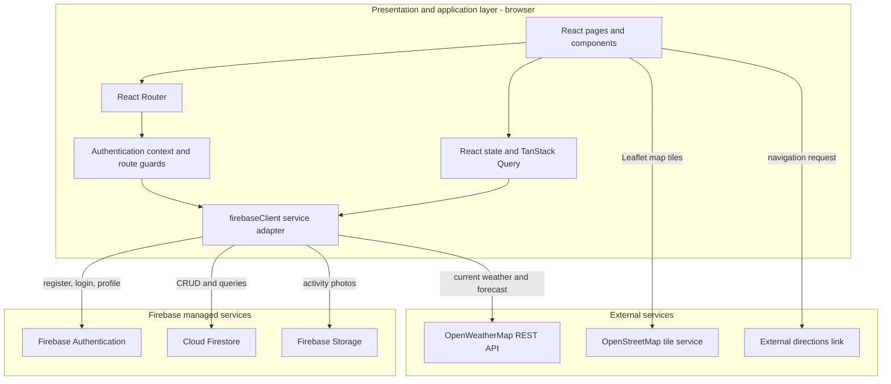
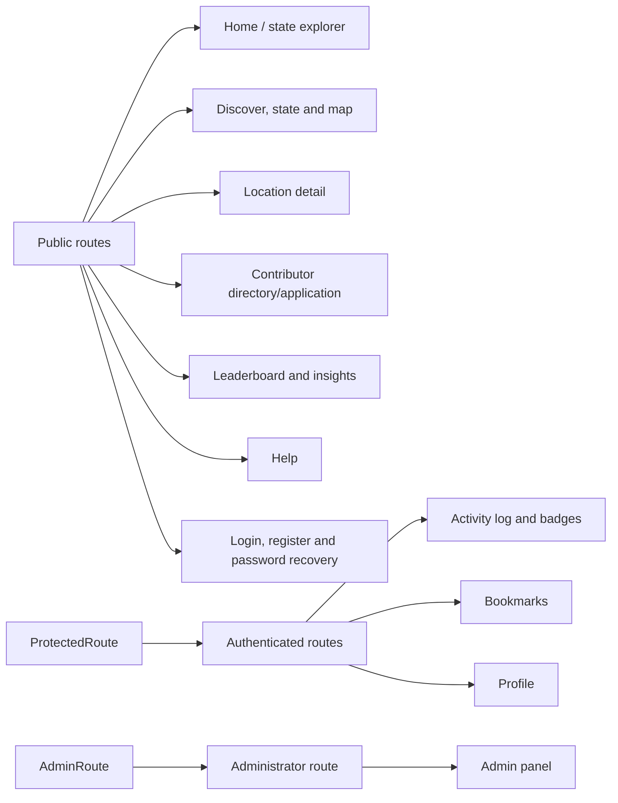
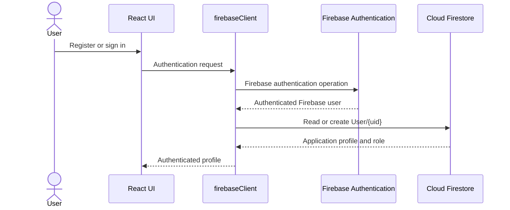
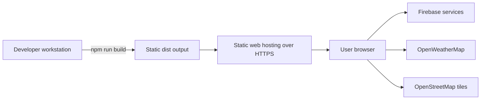

# SeekMY System Architecture

## 1. Purpose

SeekMY is a responsive web application for discovering outdoor activities in Malaysia. It supports general users, local contributor applicants, and administrators. The current prototype uses a React single-page application, Firebase managed services, OpenWeatherMap, and OpenStreetMap tiles through Leaflet.

This document describes the architecture implemented in the current source code. Features that require future server-side services are identified separately.

## 2. Architectural style

SeekMY follows a three-layer client-server architecture:

1. **Presentation layer** - React pages and reusable components receive user input and display results.
2. **Application layer** - React hooks, contexts, route guards, validation, aggregation, filtering, and the Firebase adapter implement application behaviour.
3. **Data and service layer** - Firebase Authentication, Cloud Firestore, Firebase Storage, OpenWeatherMap, and OpenStreetMap provide persistent data and external services.

## 3. Logical layers

### 3.1 Presentation layer

The presentation layer is located mainly in `src/pages`, `src/components`, and `src/components/ui`.

- `App.jsx` defines the route hierarchy.
- `Layout.jsx` provides shared navigation and page structure.
- Page components implement each functional module.
- Tailwind CSS and Radix-based components provide responsive styling and interaction patterns.
- Recharts displays activity and insight charts.
- React Leaflet displays location markers.

### 3.2 Application and business layer

Application behaviour is distributed across:

- `AuthContext.jsx` - authentication state and user profile loading.
- `ProtectedRoute.jsx` - authenticated-route enforcement.
- `AdminRoute.jsx` - administrator-route enforcement.
- Page-level handlers - validation, filters, statistics, badge evaluation, and user actions.
- `firebaseClient.js` - a common interface for authentication, CRUD operations, storage uploads, weather requests, and integration placeholders.
- `malaysia-data.js` - Malaysian states, activity types, difficulty metadata, and badge definitions.

### 3.3 Data and integration layer

Cloud Firestore stores seven application collections:

- `User`
- `Location`
- `Review`
- `Bookmark`
- `ActivityLog`
- `Badge`
- `Contributor`

Firebase Authentication stores credentials and identity-provider information. Firebase Storage stores uploaded activity photographs under `activity-photos/{userId}/...`.

## 4. Route architecture

## 5. Main runtime flows

### 5.1 Authentication

### 5.2 Location discovery

The client queries active `Location` documents, applies state and activity filters, and renders cards or Leaflet markers. Selecting a location opens `/location/:id`, which loads the location, active reviews, bookmarks, verified contributors, and weather data.

### 5.3 Activity and badge processing

An authenticated user creates or updates an `ActivityLog`. The client recalculates totals and evaluates local badge definitions. Newly satisfied badges are written to the `Badge` collection. This is client-side prototype logic rather than a trusted server-side award process.

## 6. Security boundaries

- User passwords are handled only by Firebase Authentication.
- `.env.local` is excluded from Git.
- Authentication and administrator routes are guarded in the UI.
- Firestore and Storage rules must enforce ownership and roles; client-side route guards alone are not security controls.
- AI provider secrets and OAuth client secrets must never be placed in browser code.
- The OpenWeatherMap browser key should be domain-restricted and usage-limited where supported.
- Administrator assignment should eventually use trusted server-side claims instead of relying only on an email comparison.

## 7. Deployment view

The application is built by Vite into static assets. The repository includes a web app manifest, but a service worker and offline caching are not currently implemented; therefore, the application is not yet a complete offline-capable PWA.

## 8. Planned server-side extensions

The following integrations require a trusted backend, such as Firebase Cloud Functions:

- AI Outdoor Assistant requests and provider-secret management.
- Google Calendar OAuth and token storage.
- Trusted badge awarding and leaderboard calculations.
- Contributor notifications and advanced approval workflows.
- Scheduled weekly/monthly leaderboard snapshots.
- Stronger administrator role management using custom claims.

