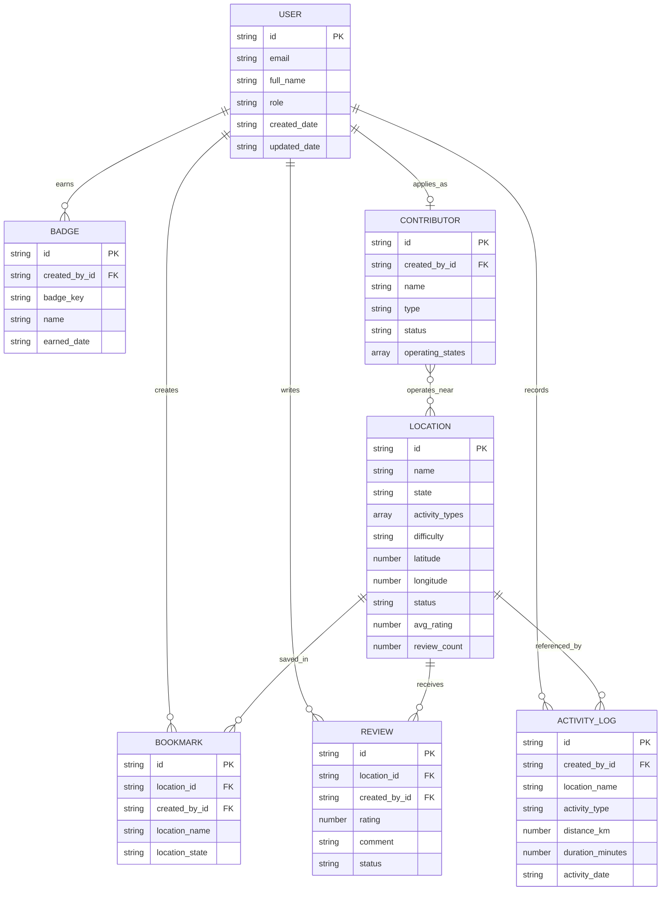

# SeekMY Database Design

## 1. Database approach

SeekMY uses Cloud Firestore, a document-oriented NoSQL database. Each business object is stored as a document in a top-level collection. Firebase Authentication manages credentials separately, while the `User` collection stores the application profile and role.

The current implementation uses these collections:

```text
User
Location
Review
Bookmark
ActivityLog
Badge
Contributor
```

Most documents created through `firebaseClient` automatically receive:

| Field | Type | Purpose |
|---|---|---|
| `created_by` | string | Creator's email address |
| `created_by_id` | string | Creator's Firebase Authentication UID |
| `created_date` | ISO date string | Client-side creation time |
| `updated_date` | ISO date string | Client-side last update time |
| `server_created_at` | Firestore timestamp | Server-generated creation time |

## 2. Entity relationship overview

Firestore does not enforce foreign keys. The relationships below are logical references stored as document IDs.



## 3. Collection definitions

### 3.1 `User`

Document ID: Firebase Authentication UID.

| Field | Type | Required | Description |
|---|---|---:|---|
| `email` | string | Yes | Authenticated email |
| `full_name` | string | Yes | Display name |
| `role` | string | Yes | `user`, `contributor`, or `admin` |
| `created_date` | string | Yes | Profile creation time |
| `updated_date` | string | No | Last profile update |

The current client initially assigns `admin` only when the authenticated email matches the configured primary administrator; all other new profiles receive `user`.

### 3.2 `Location`

| Field | Type | Required | Description |
|---|---|---:|---|
| `name` | string | Yes | Location name |
| `state` | string | Yes | Malaysian state or federal territory |
| `activity_types` | array<string> | Yes | Supported outdoor activities |
| `difficulty` | string | Yes | `Easy`, `Moderate`, or `Hard` |
| `description` | string | Yes | Location description |
| `distance_km` | number | No | Typical route distance |
| `duration_hours` | number | No | Typical duration |
| `facilities` | array<string> | No | Available facilities |
| `accessibility` | string | No | Access information |
| `best_months` | array<string> | No | Recommended months |
| `latitude` | number | Yes | Map and weather latitude |
| `longitude` | number | Yes | Map and weather longitude |
| `image_url` | string | No | Display image URL |
| `is_hidden_gem` | boolean | Yes | Home-page feature flag |
| `is_family_friendly` | boolean | No | Family filter flag |
| `is_pet_friendly` | boolean | No | Pet filter flag |
| `is_free` | boolean | No | Free-entry filter flag |
| `entry_fee` | number | No | Entry price in MYR |
| `avg_rating` | number | No | Cached average rating |
| `review_count` | number | No | Cached review count |
| `status` | string | Yes | Normally `active` or moderation status |

### 3.3 `Review`

| Field | Type | Required | Description |
|---|---|---:|---|
| `location_id` | string | Yes | Referenced `Location` document ID |
| `location_name` | string | Yes | Denormalized display value |
| `rating` | number | Yes | Rating from 1 to 5 |
| `comment` | string | Yes | Written review |
| `user_name` | string | Yes | Display name used by the prototype |
| `status` | string | No | `active`, `flagged`, or `removed` |
| `created_by_id` | string | Yes | Review author's UID |

The proposal requires a verified check-in and one review per user/location. These constraints are not yet enforced by the current client implementation and should be added before final completion.

### 3.4 `Bookmark`

| Field | Type | Required | Description |
|---|---|---:|---|
| `location_id` | string | Yes | Referenced location ID |
| `location_name` | string | Yes | Denormalized location name |
| `location_state` | string | Yes | Denormalized state |
| `location_image` | string | No | Denormalized image URL |
| `activity_types` | array<string> | No | Used for bookmark filtering |
| `created_by_id` | string | Yes | Bookmark owner's UID |

A logical uniqueness rule should prevent more than one bookmark for the same `created_by_id` and `location_id` combination.

### 3.5 `ActivityLog`

| Field | Type | Required | Description |
|---|---|---:|---|
| `activity_type` | string | Yes | Selected activity |
| `distance_km` | number | Yes | Completed distance, greater than zero |
| `duration_minutes` | number | Yes | Completed duration, greater than zero |
| `notes` | string | No | User notes |
| `state` | string | Yes | Activity state |
| `location_name` | string | Yes | Activity location |
| `activity_date` | date string | Yes | Completion date |
| `photo_url` | string | No | Firebase Storage download URL |
| `created_by_id` | string | Yes | Activity owner's UID |

### 3.6 `Badge`

| Field | Type | Required | Description |
|---|---|---:|---|
| `badge_key` | string | Yes | Stable badge-definition key |
| `name` | string | Yes | Badge name |
| `description` | string | Yes | Achievement description |
| `icon` | string | Yes | Display icon or emoji |
| `color` | string | Yes | Display colour |
| `earned_date` | date string | Yes | Award date |
| `created_by_id` | string | Yes | Badge owner's UID |

The pair `created_by_id + badge_key` should be unique. The current client checks for duplicates before writing, but trusted server-side enforcement is preferable.

### 3.7 `Contributor`

| Field | Type | Required | Description |
|---|---|---:|---|
| `name` | string | Yes | Contributor name |
| `email` | string | Yes | Contact email |
| `phone` | string | No | Contact telephone |
| `type` | string | Yes | Guide, coach, instructor, rental, or other |
| `description` | string | No | Background and expertise |
| `operating_states` | array<string> | No | States served |
| `services` | string | No | Services offered |
| `operating_areas` | string | No | More specific operating area |
| `profile_image` | string | No | Profile image URL |
| `status` | string | Yes | `pending`, `verified`, or `rejected` |
| `created_by_id` | string | Yes | Applicant's UID |

Verification-document upload, contributor-managed location submissions, and notification workflows are described in the report but are not yet present in the current prototype schema.

## 4. Query and index requirements

Likely composite indexes include:

| Collection | Filters/order |
|---|---|
| `Location` | `state ==`, `status ==` |
| `Location` | `is_hidden_gem ==`, `status ==`, `created_date desc` |
| `Review` | `location_id ==`, `status ==`, `created_date desc` |
| `ActivityLog` | `created_by_id ==`, `created_date desc` |
| `Badge` | `created_by_id ==` |
| `Contributor` | `status ==` |
| `Bookmark` | `location_id ==` and/or `created_by_id ==` |

Firestore will report a direct console link when a missing composite index is first required.

## 5. Security rules design

The database rules should implement these principles:

- Public users may read active locations and verified contributor profiles.
- Authenticated users may read and update only their own profile, bookmarks, activity logs, and badges.
- Authenticated users may create reviews as themselves; only administrators may moderate status.
- Contributor applications may be created by their owner but verified only by administrators.
- Only administrators may create, update, or delete location records and change roles.
- Clients must not be allowed to forge `created_by_id`.
- Field types, rating range, positive activity values, and allowed status values should be validated.

## 6. Data consistency considerations

Firestore does not enforce joins or cascades. The application therefore needs explicit handling for:

- Recalculating a location's rating after review create, edit, moderation, or deletion.
- Removing or retaining dependent bookmarks/reviews when a location is deleted.
- Preventing duplicate bookmarks, reviews, contributor applications, and badges.
- Using transactions or Cloud Functions for counters and ranking calculations.
- Using server timestamps for ordering where reliable chronology is required.

