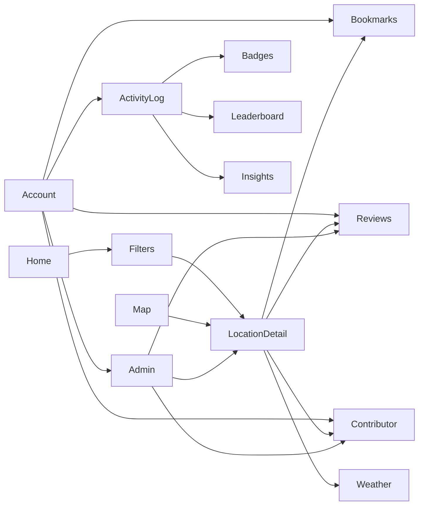

# SeekMY System Modules

## 1. Module ownership and implementation map

| # | Module | Responsible member | Main route(s) | Main implementation | Current status |
|---:|---|---|---|---|---|
| 1 | Account | Wilson Choong Wei Shan | `/login`, `/register`, `/forgot-password`, `/reset-password`, `/profile` | Authentication pages, `AuthContext.jsx`, route guards, Firebase Authentication | Implemented |
| 2 | Home / State Explorer | Low Jun Feng | `/` | `Home.jsx`, `HeroSlider.jsx`, `StateFlag.jsx` | Implemented |
| 3 | Badge Achievement | Low Jun Feng | `/activity-log` | Badge definitions and award/display logic in `ActivityLog.jsx` | Implemented in client; server validation pending |
| 4 | Weather | Wong Yue Shan | `/location/:id` | `LocationDetail.jsx`, weather invocation in `firebaseClient.js` | Partial |
| 5 | Local Contributor Portal | Wong Yue Shan | `/contributor` | `ContributorPortal.jsx`, `Contributor` collection | Partial |
| 6 | Location Detail | Lim Rou Yu | `/location/:id` | `LocationDetail.jsx` | Implemented |
| 7 | Map | Lim Rou Yu | `/map` | `MapView.jsx`, React Leaflet | Implemented with Leaflet/OSM |
| 8 | Admin Panel | Wong Yue Shan | `/admin` | `AdminPanel.jsx`, `AdminRoute.jsx` | Implemented for core moderation |
| 9 | Bookmarks | Lim Tze Xin | `/bookmarks`, `/location/:id` | `Bookmarks.jsx`, `LocationDetail.jsx` | Implemented; calendar deferred |
| 10 | Reviews and Ratings | Lim Tze Xin | `/location/:id`, `/admin` | `LocationDetail.jsx`, moderation in `AdminPanel.jsx` | Partial validation |
| 11 | Activity Filter | Wilson Choong Wei Shan | `/locations`, `/state/:stateName` | `Discover.jsx`, `StatePage.jsx` | Implemented |
| 12 | AI Outdoor Assistant | Wilson Choong Wei Shan | `/chatbot` | `Chatbot.jsx` | UI only; backend deferred |
| 13 | Community Leaderboard | Fong Xin Tong | `/leaderboard` | `Leaderboard.jsx` | Prototype implemented |
| 14 | Activity Log and Personal Statistics | Fong Xin Tong | `/activity-log`, `/insights` | `ActivityLog.jsx`, `Insights.jsx` | Implemented |
| 15 | Help and FAQ | Shared/supporting | `/help` | `Help.jsx` | Implemented |
| 16 | PWA Shell | Shared/development lead | Application-wide | `manifest.json`, Vite build | Partial; no service worker |

## 2. Module descriptions

### 2.1 Account module

**Purpose:** Manage user identity and account lifecycle.

**Implemented functions:**

- Email/password registration and login.
- Google popup login.
- Email verification and resend.
- Password-reset email and reset confirmation.
- Profile display-name update.
- Password change after reauthentication.
- Logout and account deletion.
- Protected personal routes and administrator route checking.

**Main data:** Firebase Authentication and `User` documents.

### 2.2 Home / State Explorer module

**Purpose:** Provide the main discovery entry point for Malaysia's states and federal territories.

**Implemented functions:**

- State cards with flags.
- Hero/featured content.
- Hidden Gem location selection.
- Navigation to state activity hubs.
- Search-oriented entry into discovery.

### 2.3 Badge Achievement module

**Purpose:** Reward activity milestones and encourage continued participation.

**Implemented functions:**

- Calculate totals from the user's activity records.
- Evaluate badge definitions after an activity save.
- Prevent duplicate badge keys in the loaded client state.
- Store earned badge records.
- Display earned badges in the activity page.

**Limitations:** Badge evaluation occurs in the browser. Shareable badge output and trusted server-side verification remain pending.

### 2.4 Weather module

**Purpose:** Help users assess conditions before visiting an outdoor location.

**Implemented functions:**

- Request weather by location latitude and longitude.
- Display temperature, feels-like temperature, condition, humidity, and wind.
- Display eight OpenWeatherMap forecast intervals.
- Fail without blocking the rest of the location screen.

**Limitations:** UV index, formal weather alerts, recommendation rules, caching, and a complete grouped three-day forecast remain pending.

### 2.5 Local Contributor Portal

**Purpose:** Connect users with verified guides, coaches, instructors, and service providers.

**Implemented functions:**

- Browse and filter verified contributor profiles.
- Submit name, contact information, contributor type, description, services, and operating states.
- Create applications with `pending` status.
- Administrator approval or rejection.

**Limitations:** Verification-document upload, applicant status tracking, contributor-controlled location submissions, and automated notifications remain pending.

### 2.6 Location Detail module

**Purpose:** Present detailed information required to plan an activity.

**Implemented functions:**

- Location description, activities, difficulty, distance, duration, facilities, access, and seasonal details.
- Location image and state navigation.
- Weather information.
- Bookmark control.
- Reviews and ratings.
- Verified contributor listing.

### 2.7 Map module

**Purpose:** Show outdoor locations geographically.

**Implemented functions:**

- Load active locations from Firestore.
- Plot coordinates as Leaflet markers.
- Display marker popups and location information.
- Link to directions/navigation.

**Design deviation:** The report proposed Google Maps, while the prototype uses Leaflet and OpenStreetMap.

### 2.8 Admin Panel module

**Purpose:** Provide central content and moderation controls.

**Implemented functions:**

- View locations, contributors, reviews, and users.
- Create and delete locations.
- Import curated starter locations idempotently.
- Approve or reject contributor applications.
- Activate or remove moderated reviews.
- Change application roles.

**Limitations:** Trusted role assignment, document review, rejection reasons, complete audit logging, and advanced contributor submissions remain pending.

### 2.9 Bookmark module

**Purpose:** Save destinations for later planning.

**Implemented functions:**

- Add/remove a bookmark from the location page.
- View saved-location cards.
- Filter bookmark display.
- Delete saved records.

**Limitations:** Named folders and Google Calendar integration are not complete.

### 2.10 Review and Rating module

**Purpose:** Allow community feedback on outdoor locations.

**Implemented functions:**

- Select a 1-5 rating.
- Submit a written review.
- Display active reviews.
- Recalculate cached location rating after creation.
- Administrator moderation.

**Limitations:** Verified activity check-in, one-review-per-location enforcement, editing, reporting, and transactional rating recalculation remain pending.

### 2.11 Activity Filter module

**Purpose:** Narrow locations by user preferences.

**Implemented functions:**

- State and activity-type filtering.
- Difficulty and accessibility-oriented filters.
- Family, beginner, advanced, pet-friendly, and budget-related discovery options where data is available.
- Dynamic result updates.

### 2.12 AI Outdoor Assistant module

**Purpose:** Answer outdoor questions and provide safety, equipment, and location guidance.

**Current status:** The chat interface exists, but the AI invocation is deliberately disabled until a secure Cloud Function is available. Provider keys must not be stored in the React application.

### 2.13 Community Leaderboard module

**Purpose:** Rank community participation using activity records.

**Implemented functions:**

- Load activity logs.
- Aggregate user activity values.
- Display ranked participants and top positions.

**Limitations:** Trusted identity display, scheduled weekly/monthly resets, category/location rankings, privacy controls, and server-side aggregation require further work.

### 2.14 Activity Log and Personal Statistics module

**Purpose:** Record completed activities and display progress.

**Implemented functions:**

- Create, edit, and delete activity records.
- Validate required fields and positive distance/duration.
- Upload an optional activity photo to Firebase Storage.
- Calculate totals, states explored, activity breakdown, weekly chart data, and personal bests.
- Feed badge and leaderboard calculations.

### 2.15 Help and FAQ module

**Purpose:** Explain common workflows and direct users to major features.

**Implemented functions:** Frequently asked questions and shortcut links for discovery, bookmarks, maps, activity logs, badges, weather, and contributors.

### 2.16 PWA shell

**Purpose:** Support installation and an app-like browser experience.

**Implemented:** Web app manifest and responsive application shell.

**Pending:** Service-worker registration, offline asset/data strategy, install testing, and update behaviour.

## 3. Cross-module dependencies

## 4. Final completion priorities

1. Enforce Firestore and Storage authorization rules.
2. Add verified-check-in and duplicate-review validation.
3. Complete contributor document/submission workflows or reduce the documented scope.
4. Implement the AI assistant only through a secure server-side function.
5. Implement Calendar OAuth only through a secure server-side flow.
6. Add a service worker if full PWA capability remains a project requirement.
7. Add automated tests and record integration-test evidence.
8. Reconcile every final demonstration claim with the implemented status above.
