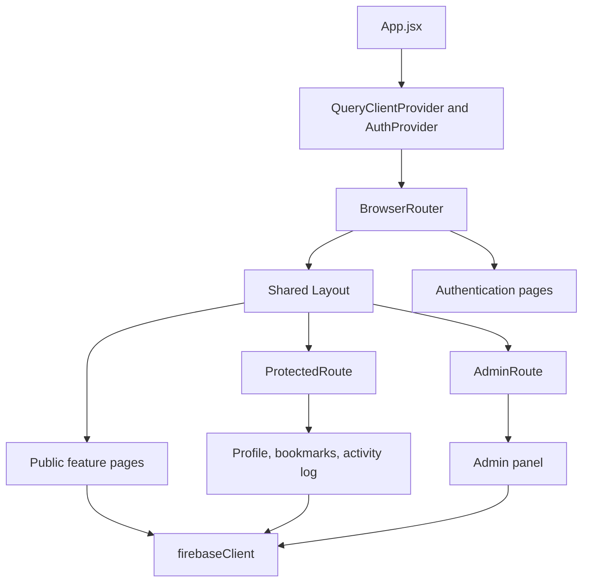
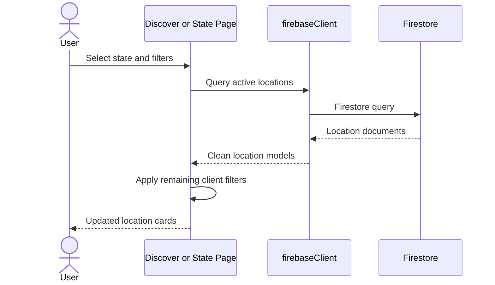

# SeekMY System Design

## 1. Design goals

SeekMY is designed to make Malaysian outdoor locations easy to discover, compare, save, and track. The interface targets desktop and mobile browsers and supports three roles:

- **General user** - discovers locations, views weather, bookmarks, reviews, records activities, earns badges, and views rankings.
- **Local contributor applicant** - submits a profile to be verified and displayed as an outdoor service provider.
- **Administrator** - manages locations, contributors, reviews, users, and starter data.

## 2. Technology decisions

| Area | Technology | Reason |
|---|---|---|
| Front end | React 18 | Component-based interactive interface |
| Build tool | Vite | Fast development and static production build |
| Routing | React Router | Public, protected, and administrator routes |
| Styling | Tailwind CSS and Radix-based UI | Responsive and reusable interface components |
| Server state | TanStack Query and page-level React state | Loading, caching, and UI state |
| Authentication | Firebase Authentication | Email/password, Google sign-in, verification, reset |
| Database | Cloud Firestore | Managed document database and real-time-ready SDK |
| File storage | Firebase Storage | Activity photograph uploads |
| Maps | React Leaflet and OpenStreetMap | Interactive maps without embedding map credentials |
| Weather | OpenWeatherMap REST API | Current conditions and forecast intervals |
| Charts | Recharts | Activity and insight visualisations |

## 3. Component structure



## 4. Route design

| Route | Access | Screen |
|---|---|---|
| `/` | Public | Home and state explorer |
| `/login` | Public | Login |
| `/register` | Public | Registration |
| `/forgot-password` | Public | Password-reset request |
| `/reset-password` | Public | New-password confirmation |
| `/state/:stateName` | Public | State activity hub |
| `/location/:id` | Public | Location details, weather, bookmarks, reviews |
| `/map` | Public | Leaflet location map |
| `/locations` | Public | Discover and filter locations |
| `/chatbot` | Public UI | AI assistant interface; backend unavailable |
| `/contributor` | Public | Contributor directory and application |
| `/leaderboard` | Public | Community ranking |
| `/insights` | Public | Aggregated insights |
| `/help` | Public | FAQ and support |
| `/activity-log` | Authenticated | Activity history, statistics, badges |
| `/bookmarks` | Authenticated | Saved locations |
| `/profile` | Authenticated | Profile and account management |
| `/admin` | Administrator | Administration panel |

## 5. Authentication and authorization design

Firebase Authentication is the identity authority. After authentication, the application reads `User/{uid}` to obtain the display profile and role. `AuthContext` exposes authentication state to the component tree.

`ProtectedRoute` prevents unauthenticated access to personal screens. `AdminRoute` checks the application role before rendering the administrator panel. Equivalent authorization must also be enforced in Firestore and Storage rules because browser-side checks can be bypassed.

## 6. Interface design principles

- Consistent navigation, colours, typography, spacing, buttons, and cards.
- Responsive layouts for desktop and mobile screens.
- Visible loading skeletons or progress indicators for remote data.
- Empty-state messages when no locations, contributors, bookmarks, or records exist.
- Clear validation for required fields and invalid numerical values.
- Touch-friendly controls and readable text contrast.
- Semantic headings, labels, alternative image text, and keyboard-accessible interactions.

The current visual language uses nature-oriented greens for discovery, indigo/purple for contributors, neutral backgrounds, rounded cards, and clear status colours.

## 7. Feature interaction designs

### 7.1 Discover and filter



### 7.2 Bookmark

An authenticated user selects the bookmark control on a location. The application creates a denormalized `Bookmark` document for quick display. Selecting it again finds and deletes matching bookmark documents.

### 7.3 Review and rating

The current prototype creates a review and recalculates the cached location average in the client. The final design should validate authenticated ownership, verified activity check-in, one review per user/location, rating bounds, and moderation status in trusted rules or server logic.

### 7.4 Activity log and badges

Users record activity type, location, state, date, distance, duration, notes, and an optional photo. The page calculates totals and weekly chart values. Badge definitions are evaluated after saving an activity.

### 7.5 Leaderboard and insights

The prototype loads activity records and calculates rankings/aggregates in the browser. A production design should use trusted precomputed summaries or Cloud Functions for scale, privacy, scheduled periods, and tamper resistance.

### 7.6 Administration

The administrator panel loads locations, contributors, reviews, and users. It supports location creation/deletion, curated starter-location import, contributor approval/rejection, review moderation, and role changes.

## 8. External integration design

### 8.1 Weather

`firebaseClient.functions.invoke("getWeather")` requests current conditions and forecast data using location coordinates. The interface displays temperature, description, humidity, wind, and forecast intervals.

Current limitation: UV index, formal severe-weather alerts, advisory rules, caching, and a complete three-day grouped forecast are not implemented.

### 8.2 Maps

The map uses React Leaflet with OpenStreetMap tiles. Active location coordinates become interactive markers. This differs from the proposal's Google Maps design but fulfils the prototype's main marker and map-navigation requirement.

### 8.3 AI assistant

The chat interface exists, but `InvokeLLM` intentionally throws an explanatory error. A Cloud Function must validate requests, store the provider secret, apply safety controls, and return a limited response to the browser.

### 8.4 Calendar

The bookmark interface includes a calendar integration path, but OAuth is intentionally unavailable. A server-side authorization flow and secure token storage are required.

## 9. Error-handling design

- Missing Firebase configuration produces a clear configuration error.
- Authentication failures are displayed by account pages.
- Missing locations produce a not-found state.
- Loading states prevent empty content from appearing as completed data.
- Weather failure does not block the location details page.
- File upload validates image type and a 1.5 MB size limit.
- Destructive activity deletion requires confirmation.

Future improvement should add a shared error boundary, consistent toast messages, retry policies, and logging for unexpected failures.

## 10. Build, configuration, and deployment

Required browser configuration is documented in `.env.example`:

```text
VITE_FIREBASE_API_KEY
VITE_FIREBASE_AUTH_DOMAIN
VITE_FIREBASE_PROJECT_ID
VITE_FIREBASE_STORAGE_BUCKET
VITE_FIREBASE_MESSAGING_SENDER_ID
VITE_FIREBASE_APP_ID
VITE_OPENWEATHER_API_KEY
```

`.env.local`, `node_modules`, and `dist` are excluded from Git. The main commands are:

```bash
npm install
npm run dev
npm run lint
npm run build
```

## 11. Current completion boundary

Implemented prototype areas include authentication, discovery, filters, location details, maps, weather basics, bookmarks, reviews, contributors, administration, activity logs, badges, leaderboard, insights, and help.

The following remain incomplete or partial:

- Secure AI backend.
- Google Calendar OAuth.
- Full contributor document and location-submission workflow.
- Verified-check-in review restriction.
- Server-authoritative badges and rankings.
- Full PWA service worker and offline caching.
- Complete automated test coverage.

